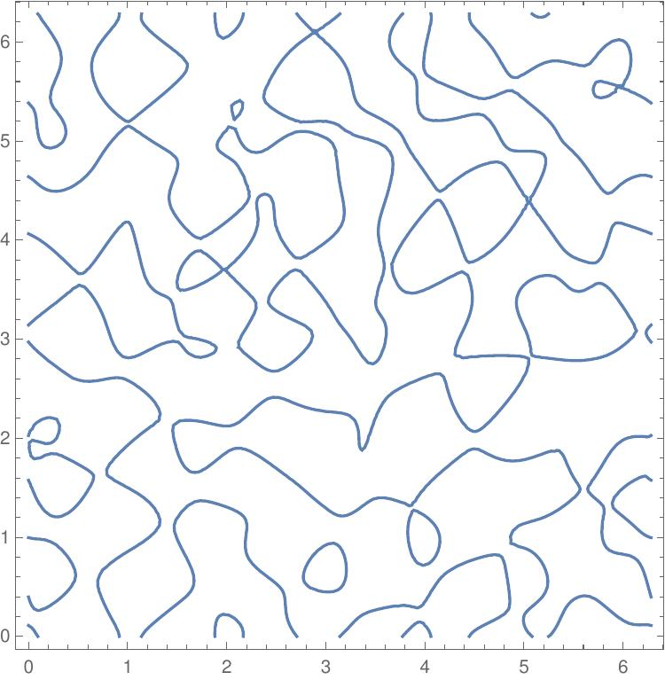
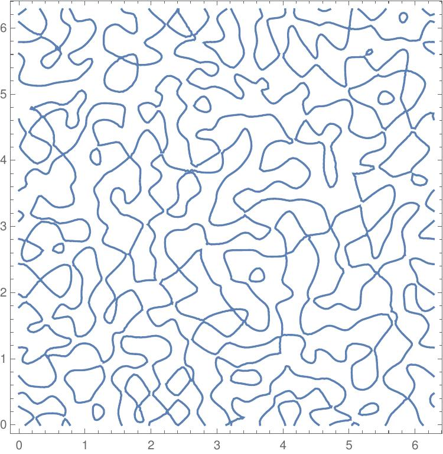
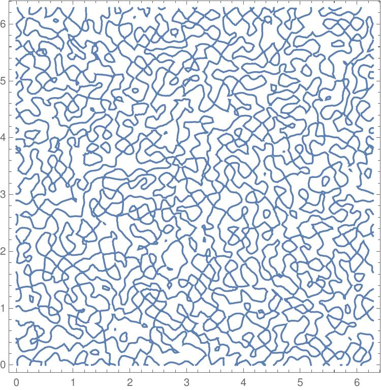
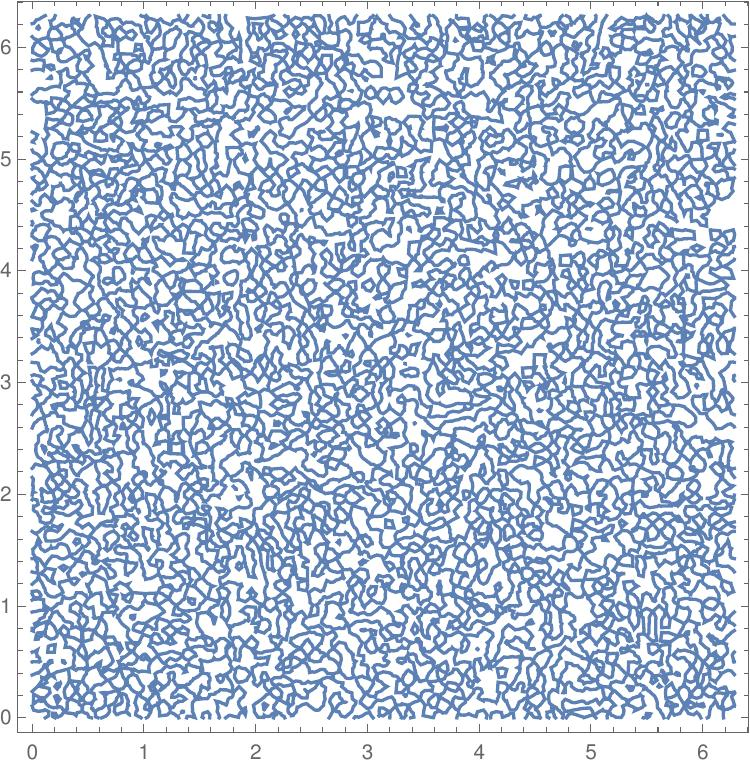

# gaussian-singularities
*Expected length of singular contours of Gaussian random maps.*

Mathematica notebooks accompanying the paper [Singularities of Gaussian random maps into the plane](https://arxiv.org/abs/2202.08242).

### Critical curves of Gaussian random bandlimited functions on the 2-torus with bandwidth 4,8,16,32.

 
 

## Files

- random_bandlimited_functions.nb: Experimental computation of the expected length of singular contours of random bandlimited functions on the flat torus.
- random_torus_projections.nb: Theoertical computation of the expected length of singular contours of random linear projections of the standard embedding of a torus.
